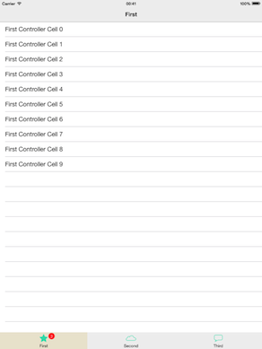
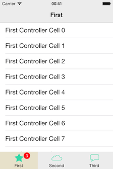

# RDVTabBarController

[](Screenshots/iPad.png)

[](Screenshots/iPhone.png)

* Supports iPad and iPhone
* Supports landscape and portrait orientations
* Can be used inside UINavigationController
* Customizable badges

## Installation

### CocoaPods

If you're using [CocoaPods](http://www.cocoapods.org), simply add `pod 'RDVTabBarController'` to your Podfile.

### Drag & Drop

Add the items from `RDVTabBarController` directory to your project. If you don't have ARC enabled, you will need to set a `-fobjc-arc` compiler flag on the `.m` source files.

## Example Usage

Initialize RDVTabBarController:

```
UIViewController *firstViewController = [[RDVFirstViewController alloc] init];
UIViewController *firstNavigationController = [[UINavigationController alloc]
                                               initWithRootViewController:firstViewController];

UIViewController *secondViewController = [[RDVSecondViewController alloc] init];
UIViewController *secondNavigationController = [[UINavigationController alloc]
                                                initWithRootViewController:secondViewController];

UIViewController *thirdViewController = [[RDVThirdViewController alloc] init];
UIViewController *thirdNavigationController = [[UINavigationController alloc]
                                               initWithRootViewController:thirdViewController];

RDVTabBarController *tabBarController = [[RDVTabBarController alloc] init];
[tabBarController setViewControllers:@[firstNavigationController, secondNavigationController,
                                       thirdNavigationController]];
self.viewController = tabBarController;
```

Customize RDVTabBarController:

```
UIImage *finishedImage = [UIImage imageNamed:@"tabbar_selected_background"];
UIImage *unfinishedImage = [UIImage imageNamed:@"tabbar_normal_background"];
NSArray *tabBarItemImages = @[@"first", @"second", @"third"];

RDVTabBar *tabBar = [tabBarController tabBar];

[tabBar setFrame:CGRectMake(CGRectGetMinX(tabBar.frame), CGRectGetMinY(tabBar.frame), CGRectGetWidth(tabBar.frame), 63)];

NSInteger index = 0;
for (RDVTabBarItem *item in [[tabBarController tabBar] items]) {
    [item setBackgroundSelectedImage:finishedImage withUnselectedImage:unfinishedImage];
    UIImage *selectedimage = [UIImage imageNamed:[NSString stringWithFormat:@"%@_selected",
                                                  [tabBarItemImages objectAtIndex:index]]];
    UIImage *unselectedimage = [UIImage imageNamed:[NSString stringWithFormat:@"%@_normal",
                                                    [tabBarItemImages objectAtIndex:index]]];
    [item setFinishedSelectedImage:selectedimage withFinishedUnselectedImage:unselectedimage];

    index++;
}
```

## Requirements

* ARC
* iOS 5.0 or later
* Xcode 5

## Contact

[Robert Dimitrov](http://robbdimitrov.com)   
[@robbdimitrov](https://twitter.com/robbdimitrov)

## License

RDVTabBarController is available under the MIT license. See the LICENSE file for more info.
